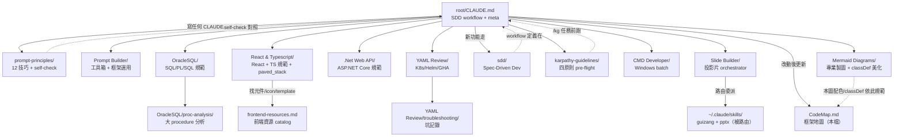

[TOC]

## File Index

| Domain | CLAUDE.md 路徑 | 行數 | 核心職責 | Slash Command |
|--------|---------------|------|---------|---------------|
| root | `CLAUDE.md` | 95 | SDD workflow + meta rules + 目錄導覽 | — |
| prompt-principles | `prompt-principles/CLAUDE.md` | 212 | 12 prompt 技巧 + self-check checklist | — |
| Prompt Builder | `Prompt Builder/CLAUDE.md` | 310 | 使用者寫 prompt 工具箱（框架選用 + 6 品質維度）| `/prompt-improve` |
| OracleSQL | `OracleSQL/CLAUDE.md` | 121 | Oracle SQL/PL/SQL 規範（schema、package、bulk DML）| — |
| OracleSQL/proc-analysis | `OracleSQL/proc-analysis/CLAUDE.md` | ~60 | 10K+ 行 procedure 靜態分析 + 筆記庫 | `/proc-analyze` |
| React & TypeScript | `React & Typescript/CLAUDE.md` | 129 | React 18+/19 + TS strict + paved_stack（Tailwind+cn / antd Hybrid / SWR+axios 資料層 / lucide）| — |
| React & TS/resources | `React & Typescript/frontend-resources.md` | 135 | 前端資源 catalog（元件/icon/template/動效/靈感）+ 決策樹 | — |
| .Net Web API | `.Net Web API/CLAUDE.md` | 103 | ASP.NET Core 8+ layered API（DI、async/await、DTO）| — |
| YAML Review | `YAML Review/CLAUDE.md` | 165 | K8s/Helm/ArgoCD/GHA YAML review + 10 點 checklist | `/k8s-review` |
| YAML/troubleshooting | `YAML Review/troubleshooting/CLAUDE.md` | ~30 | 公司內部 K8s 部署坑經驗庫 | — |
| sdd | `sdd/CLAUDE.md` | 93 | Spec-Driven Development（規格 → stub → 實作）| `/sdd` |
| karpathy-guidelines | `karpathy-guidelines/CLAUDE.md` | 137 | 四原則 pre-flight（Think/Simplicity/Surgical/Goal）| `/kg` |
| CMD Developer | `CMD Developer/CLAUDE.md` | 222 | Windows batch `.bat` 規範 + 9 大雷區 | `/cmd-dev` |
| Slide Builder | `Slide Builder/CLAUDE.md` | 74 | 投影片 orchestrator：路由 pptx / guizang HTML + brand kit | slide-builder skill |
| Mermaid Diagrams | `Mermaid Diagrams/CLAUDE.md` | 103 | 專業 Mermaid 製圖：base theme + 語義 classDef 美化、語法防呆、mmdc/Kroki 匯出 | mermaid-diagrams skill |

## Dependency Graph

## Key Rules Index

| 規則 | 位置 | 觸發時機 |
|------|------|---------|
| 寫/改 CLAUDE.md 前先讀 prompt-principles | root `<critical_notes>` | 任何 CLAUDE.md 異動 |
| 改動後更新 `CodeMap.md` | root `<critical_notes>` | 讀 domain CLAUDE.md 或框架改動後 |
| 非 trivial 功能 MUST 走 SDD | root `<workflow>` + sdd/ | 新功能開發 |
| Karpathy `/kg` pre-flight | karpathy-guidelines/ | 任何非 trivial 編碼任務開始前 |
| 先問假設再動工 | karpathy-guidelines/ 原則 1 | 模糊任務 |
| 規格確認前不動 production code | sdd/ `<critical_notes>` | 開發前 |
| 12 點 self-check 跑一次 | prompt-principles/ `<self-check>` | 寫完 prompt / CLAUDE.md |
| 大 procedure → `/proc-analyze` | OracleSQL/ `<common_tasks>` | 讀 10K+ 行 PL/SQL |
| CodeMap 前置 → code review | Global CLAUDE.md（user）| `/code-review` 或「幫我看 code」|
| 撞 K8s 坑 30 分鐘內補 troubleshooting | YAML Review/ `<common_tasks>` | 部署後踩坑 |

## Coverage Assessment

| Domain | 完整度 | 已知 Gap / 風險點 |
|--------|--------|-----------------|
| prompt-principles | ✅ 完整 | — |
| sdd | ✅ 完整 | — |
| karpathy-guidelines | ✅ 完整 | — |
| OracleSQL | ✅ 完整 | proc-analysis 筆記庫（`notes/`）靠人工維護，易過時 |
| React & TypeScript | ✅ 完整 | 已補 paved_stack + frontend-resources catalog；仍缺 testing pattern（Vitest / Testing Library）|
| .Net Web API | ⚠️ 可補 | 缺 integration test pattern（WebApplicationFactory 用法）|
| YAML Review | ✅ 完整 | troubleshooting case 數靠 on-call 補，無 SLA 可能落後 |
| Prompt Builder | ✅ 完整 | 框架選擇決策樹豐富；LLM 判斷 prompt 品質的範例相對薄 |
| CMD Developer | ✅ 完整 | Windows-only；跨平台腳本需求需另開 PowerShell 規範 |
| Slide Builder | ⚠️ 待裝 | pptx skill 尚未安裝（需自 anthropics/skills 複製）；HTML 路由 guizang 已就緒 |
| Mermaid Diagrams | ✅ 完整 | mmdc 匯出需本機 Node；無 Node 走 Kroki（敏感圖勿送公開 Kroki，改自架） |
| YAML/troubleshooting | ⚠️ 薄 | Case 數量不明，建議定期盤點 |
