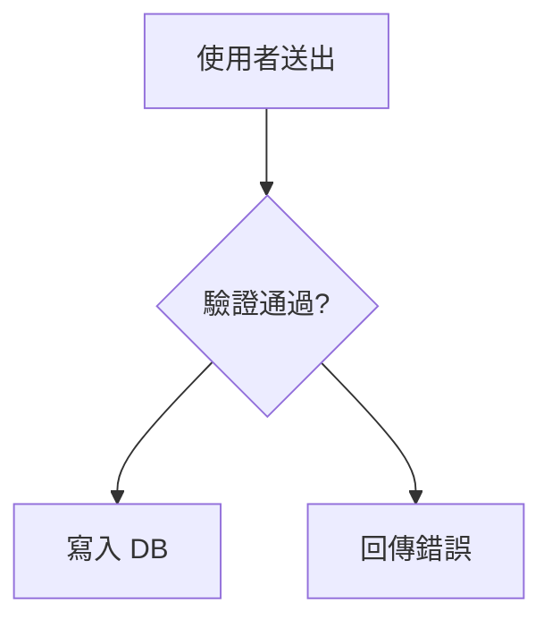
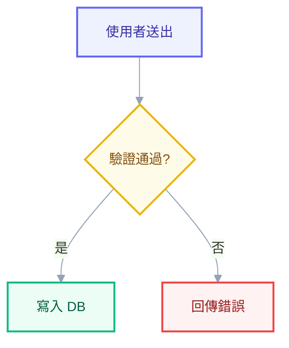

# Mermaid Diagrams — 專業 Mermaid 製圖規範

<system_context>
在 `.md` 裡產出「不醜」的 Mermaid 圖。預設 theme + 放任自動排版 = 醜；專業感只來自三件事：
base theme + themeVariables、語義 classDef 上色、克制的版式。
本檔是框架側規範入口；實際工作流在 `SKILL.md`（可安裝成 reusable skill）。
渲染目標以 GitHub / VSCode `.md` 為主；需要圖檔時用 mmdc 匯出 PNG/SVG（見 `references/render.md`）。
</system_context>

<critical_notes>
- MUST 每張圖開頭加 `%%{init}%%` 用 `theme: base` + themeVariables
  NEVER 用預設 theme 直接畫
  Why: 預設 theme 的飽和配色與直角折線是 Mermaid 醜的主因；且**只有 base theme 可客製** themeVariables
- MUST 節點用語義 classDef 上色（primary/success/warn/error/decision/accent/muted），NEVER 逐節點手寫 `style nodeX fill:...`
  Why: 同類節點同色 = 可讀性 + 視覺一致；classDef 定義一次重用，改色只改一處
- MUST themeVariables 與 classDef 顏色只吃 hex（`#6366f1`），NEVER 用顏色名（`red`、`blue`）
  Why: Mermaid theming engine 只認 hex，顏色名會被忽略或讓 theme 失效
- MUST 產圖前對照 `references/syntax-pitfalls.md` 自查
  Why: 特殊字元、保留字 `end`、`o`/`x` 開頭的 node ID 會讓圖**直接壞掉**，比醜更糟
- MUST 大圖（>15 節點）用 subgraph 分群 + 選對方向，NEVER 放任一張圖塞滿讓線交叉
- 預設繁體中文，technical terms 保留英文
</critical_notes>

<file_map>
CLAUDE.md                  - 本檔（框架側規範入口）
SKILL.md                   - 製圖工作流（複製到 `~/.claude/skills/mermaid-diagrams/` 成可裝 skill）
references/
  ├── theme.md             - init block 範本 + themeVariables 清單 + 語義 classDef recipes（深/淺兩套）
  ├── syntax-pitfalls.md   - 語法防呆清單（good/bad 對照，~10 個常見壞圖原因）
  ├── diagram-types.md     - 各圖型選用決策表 + pattern（flowchart/sequence/class/state/ER/C4/gantt/mindmap）
  ├── render.md            - mmdc 安裝 + 匯出 PNG/SVG + Kroki fallback（PowerShell）
  └── render-mermaid.ps1   - 從 .mmd/.md 匯出圖檔的腳本（mmdc 優先，Kroki 備援）
</file_map>

<paved_path>
**四步製圖**（細節見 `SKILL.md`）：
1. **選圖型** → 查 `references/diagram-types.md` 決策表（流程→flowchart、互動時序→sequence、資料→ER…）
2. **貼 init block** → 從 `references/theme.md` 複製範本，挑淺色（文件）或深色（dark-mode 文件）
3. **畫結構 + 套語義 classDef** → 在圖尾貼 classDef 定義，用 `class a,b success;` 或 `a:::success` 套用
4. **自查語法**（`syntax-pitfalls.md`）→ 需要靜態圖檔再 mmdc 匯出（`render.md`）

**配色主軸**：低飽和 fill + 高飽和 border + 深色文字（用 Tailwind 色階）。同類節點套同一個 class。
**版式克制**：方向選對（流程 `TD`、時序/管線 `LR`）、`curve: basis` 平滑線、subgraph 分群、節點文字精簡到 ≤6 字。
</paved_path>

<patterns>
- init block 範本（深/淺）→ `references/theme.md`, search:`theme: base`
- 語義 classDef recipes → `references/theme.md`, search:`classDef primary`
- 各圖型 pattern → `references/diagram-types.md`, search:`## flowchart`
- 匯出圖檔 → `references/render.md`, search:`mmdc -i`
</patterns>

<common_tasks>
- 畫一張流程圖 → 跑 mermaid-diagrams skill，或直接照 `paved_path` 四步
- 安裝成可裝 skill → 複製 `SKILL.md` + `references/` 到 `~/.claude/skills/mermaid-diagrams/`
- 改全域配色 → 只改 `references/theme.md` 的 themeVariables 與 classDef，不動各圖
- 把 .md 的 mermaid 匯成 PNG/SVG → 跑 `references/render-mermaid.ps1`
- CodeMap 的 Dependency Graph → 直接套本規範的 init block + classDef（root `CodeMap.md` 是現成範例）
</common_tasks>

<example>
**同一張流程圖：預設（醜）vs 套規範（專業）**

❌ Bad（無 init、無 classDef、方向沒選、直角折線）

✅ Good（base theme + curve basis + 語義 classDef）

Why：init 換掉預設配色、`curve:basis` 把折線變弧線、邊加 `|是|/|否|` 標籤、決策點/成功/錯誤用語義色一眼分群。
</example>

<hatch>
- 一張臨時草圖、只給自己看 → 可省 classDef，但 init block 仍建議貼（成本低、效果大）
- 渲染環境不吃 `%%{init}%%`（少數舊 viewer）→ 退而用各節點 `style`，或改走 mmdc 匯出靜態圖
- 圖太大撐爆一張 → 拆成多張（依 subgraph 邊界切），用文字串接，NEVER 硬塞
</hatch>

<fatal_implications>
- NEVER 把 secret / 內部 URL / 真實客戶名 / 連線字串畫進圖（圖會進 .md 進 git）
- NEVER 用顏色名或非 hex 值（theme 會失效）
- NEVER 跳過 `syntax-pitfalls.md` 自查就交付（壞掉的圖比醜的圖更糟）
- NEVER 單張圖塞超過一個螢幕還不分 subgraph / 不拆圖
</fatal_implications>
