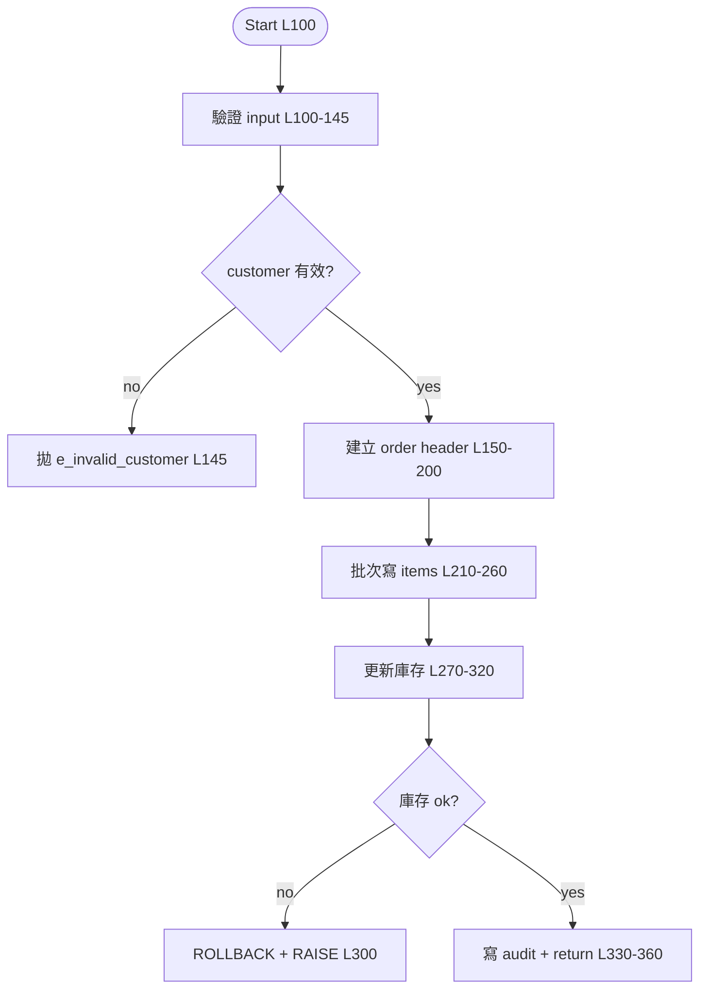
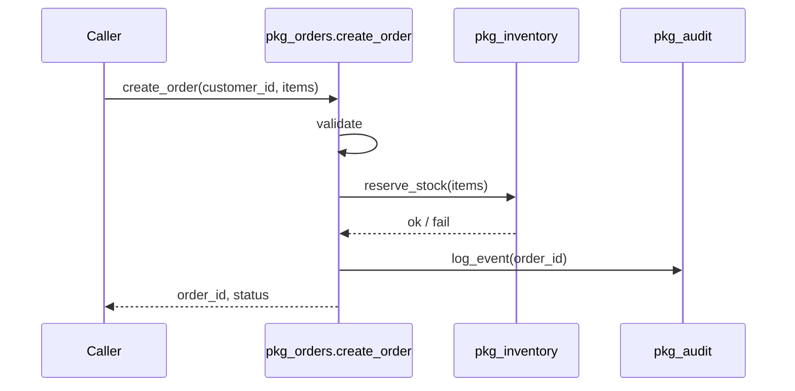
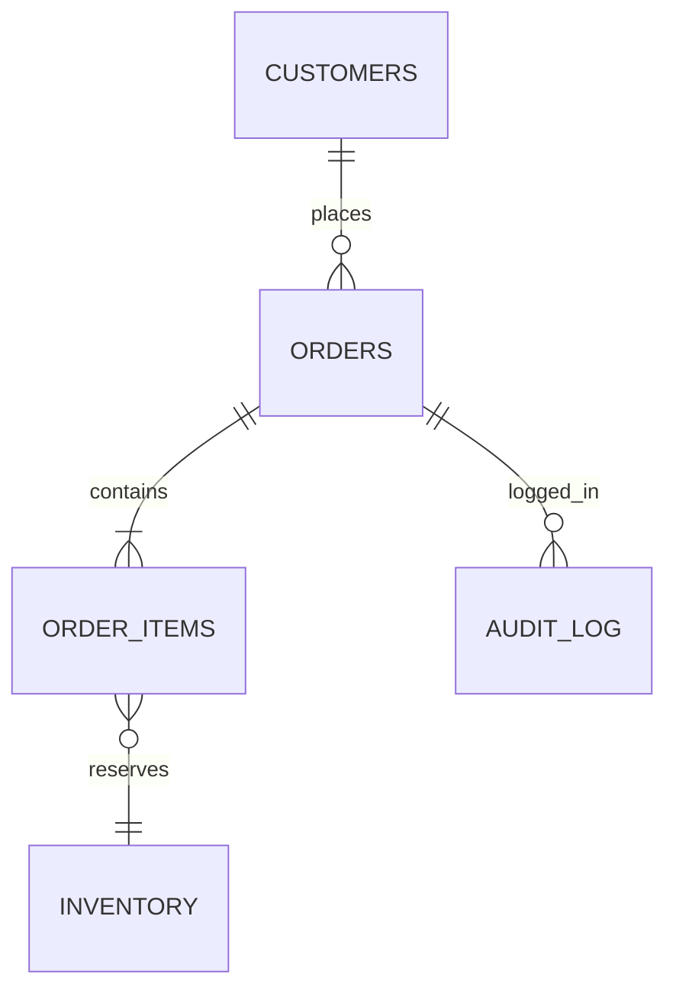

# `<schema>.<package>.<proc>`

## TL;DR

<3 句話：這支 proc 做什麼、輸入什麼、產出什麼。商業語意優先，技術細節靠後。>

## Signature & Contracts

### Parameters

| Name | Direction | Type | Description |
|------|-----------|------|-------------|
| p_customer_id | IN | NUMBER | <用途> |
| p_order_id | OUT | NUMBER | <用途> |

### Raises

| Exception | When | 行號 |
|-----------|------|------|
| e_invalid_customer | customer 不存在或被鎖定 | L148 |
| no_data_found | 找不到對應 inventory | L210 |

### Pre-conditions

- <呼叫前需滿足，e.g. customer 必須已 commit>

### Post-conditions

- <成功執行後保證的狀態，e.g. orders 表多一筆、inventory 數量遞減>

## Data Touched

| Table | 動作 | 條件 / WHERE | 行號 |
|-------|------|--------------|------|
| orders | INSERT | - | L150 |
| order_items | INSERT (FORALL) | per item | L180 |
| inventory | UPDATE | item_id = :id | L210 |
| audit_log | INSERT | - | L280 |

R = SELECT、W = INSERT/UPDATE/DELETE、RW = SELECT FOR UPDATE / MERGE

## Call Graph

### Calls (this → others)

| Callee | Type | 用途 | 行號 | 已有筆記 |
|--------|------|------|------|----------|
| pkg_inventory.reserve_stock | proc | 鎖庫存 | L200 | [link](./erp.pkg_inventory.reserve_stock.md) |
| pkg_audit.log_event | proc | 寫稽核 | L280 | <TODO> |
| fn_calc_discount | func | 計算折扣 | L160 | <TODO> |

### Called by (others → this)

（grep 其他筆記得到的 caller，可能不全）

- `pkg_api.handle_order_request` (L450)

## Main Flow

編號階層步驟，每步配行號範圍 + 一句話。

1. **驗證 input** [L100–L145]
   - 1.1 檢查 `p_customer_id` 非 null [L105]
   - 1.2 query customer 狀態，狀態 = `BLOCKED` 拋 `e_invalid_customer` [L120–L145]
2. **建立 order header** [L150–L200]
   - 2.1 取 sequence `seq_order_id` [L152]
   - 2.2 INSERT orders [L160]
   - 2.3 呼叫 `fn_calc_discount` 算折扣 [L170]
3. **批次寫 order items** [L210–L260]
   - 3.1 BULK COLLECT items 到 `l_items` [L215]
   - 3.2 FORALL INSERT order_items [L240]
4. **更新庫存** [L270–L320]
   - 4.1 呼叫 `pkg_inventory.reserve_stock` [L280]
   - 4.2 失敗 → rollback savepoint，拋 exception [L300]
5. **寫 audit log + return** [L330–L360]

## Branching Map

只列「業務語意 branch」，技術 null check 跳過。

| 條件 | True 分支 | False 分支 | 行號 |
|------|-----------|------------|------|
| `customer_status = 'BLOCKED'` | 拋 e_invalid_customer | 繼續 | L120 |
| `p_items.COUNT = 0` | 直接 return | 進 FORALL | L210 |
| `l_total > l_credit_limit` | 拋 e_credit_exceeded | 繼續 | L250 |

## Loops

| 類型 | 範圍 | 用途 | 行號 |
|------|------|------|------|
| FORALL | 1..l_items.COUNT | bulk INSERT items | L240 |
| FOR cursor | c_old_orders | 清理舊單 | <若有> |

## Exception Handling

| Block | 處理對象 | 動作 | 行號 |
|-------|----------|------|------|
| inner (item loop) | DUP_VAL_ON_INDEX | 標重複、continue | L245 |
| outer | OTHERS | log + ROLLBACK + RAISE | L355 |

## Mermaid — Main Flow



## Mermaid — Call Sequence



## Mermaid — Data ER



## Risks / TODO / Smells

- [ ] <e.g. L300 ROLLBACK 後沒釋放 savepoint，可能 leak>
- [ ] <e.g. L160 INSERT 沒走 bulk，items 多會慢>
- [ ] <e.g. exception block 吞 OTHERS 沒 RAISE → 違反 critical_notes>

## Glossary（業務術語）

| 術語 | 意義 |
|------|------|
| BLOCKED customer | 風控標記，禁止下單 |
| credit_limit | 月度信用額度 |

## Source Snippets

只貼「關鍵邏輯」5–10 行，不要整段。

```sql
-- L120-128: 業務檢查
IF l_customer_status = 'BLOCKED' THEN
  log_error('blocked customer', p_customer_id);
  RAISE e_invalid_customer;
END IF;
```

## References

- 原始檔 / SVN / wiki：
- 相關規格（specs/）：
- 相關 proc 筆記：
